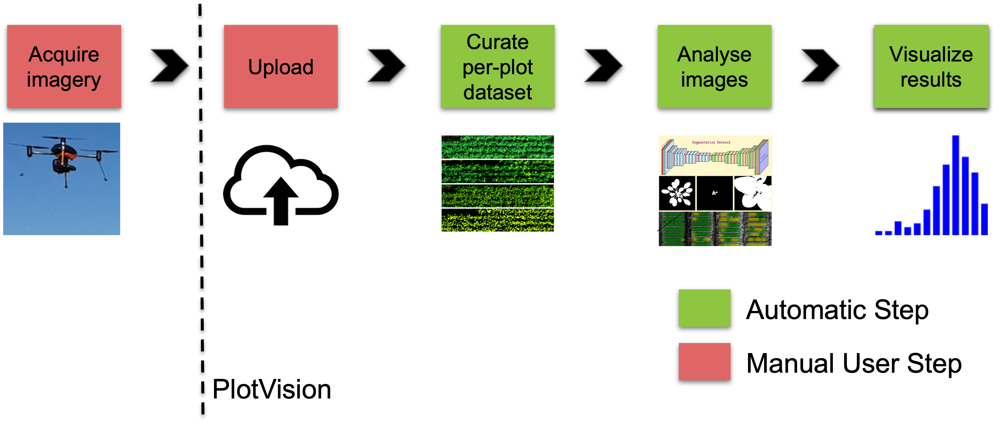
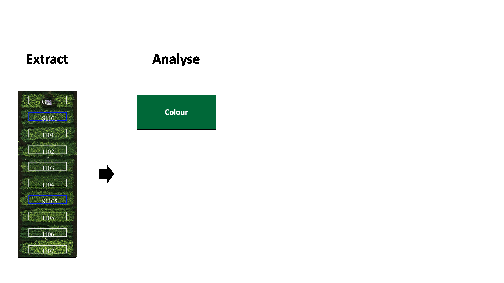

Basics
===================

What is PlotVision
-------------------

PlotVision is a cloud based Software as a Service (SaaS) that applies image analysis metrics to quickly assess large numbers of micro-plots from Unmanned Aerial Vehicle (UAV) multi-spectral imagery.PlotVision will create an orthomosaic and DSM from the images, and calculate metrics such as height, volume, and NDVI of individual micro-plots after a segmentation. PlotVision can be found at `<https://plotvision.usask.ca/>`_

The software is designed with plant research breeders in mind. We strive to make our system work with any UAV, sensor, camera, and imaging operation you have. The simplest and most heavily supported is our UAV pipeline. PlotVision does not perform imaging ourselves, but we do make every step afterwards as easy as possible.

After imaging your research fields (please read :doc:`Pre-Flight Information` before doing so), you can :doc:`upload <Uploading a Mission Flight>` your imagery straight to the PlotVision website. Similar to other programs, your data is categorized, and the images are stitched into an orthomosaic. Where PlotVision shines however, is the benefits we provide after stitching is complete. Unlike other websites, we offer tools to extract and divide the orthomosaics into the individual research plots. We then automatically take those research plots and perform analysis on them based on the crop and sensors used. Lastly, all of these segmented plots and the analysis are available for export into your own data processing pipelines.

Provided Analytics
^^^^^^^^^^^^^^^^^^^

- Spectral Indices
- Vegetation-segmented spectral indices
- Canopy height, ground cover, and volume
- Canola flower area
- All of the above over time

More information about all we export can be found in :doc:`Data Exportation`

Terminology
------------

The use of PlotVision comes with a lot of jargon that may get confusing, especially when coming to the developers for assistance. These may be some terms you here, and some may be slightly different from what you're used to.

*trial*
    A single in-field agricultural experiment, consisting of some number of plots and reps in a specific layout.

*range*
    A group of plots within a trial, arranged in a line.

*bloc*
    A group of ranges within a trial. Usually corresponds to a single rep.

*plot*
    The experimental atomic unit of a trial. Each plot has a specific variety or treatment of the same crop, and has a unique plot ID.

*rep*
    "Replications" of a single plot. Used to accommodate for environmental variability in a trial.

.. image:: images/basics/terminology.png
    :width: 800
    :alt: IMAGE FAILED; ALT DESCRIPTION:
|

*row*
    A single line of seeded plants within a trial. Can span ranges. Multiple rows of the same treatment form a plot.

*field*
    The physical location containing experimental trials. Can contain more than one trial.

*mission*
    A single flight or group of images of a field. Can contain multiple trials within. Can only have one sensor type.

*sensor type*
    The camera used to image during a mission.

*trial map*
    Details of a trial layout specifying the dimensions and cardinal directions of a given trial, used for plot segmentation.

*ground control points (GCPs)*
    Physical markers than can be permanently placed in a field. These markers can be RTK GPSed for precise georeferencing without the need of a sensor with GPS. These markers are very specific and can be automatically detected by our software.

*segmentation*
    The segmentation, or extraction, of the plots in a mission flight orthomosaic. More information about how to do a segmentation can be found in :doc:`Plot Extraction`

*bulk export*
    A form of exporting data in PlotVision. This method specifically will provide to you all of the data that we currently have on a given trial, mission, or segmentation.

