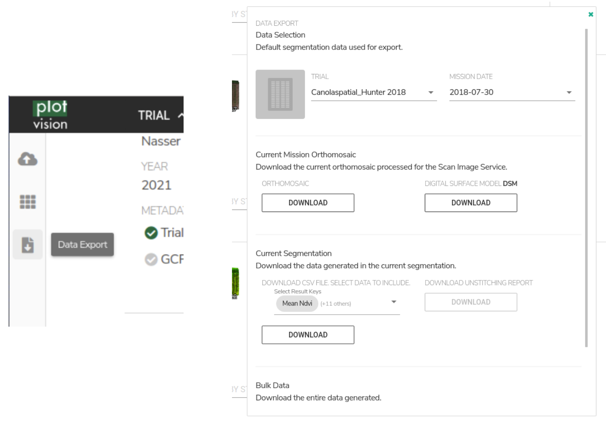
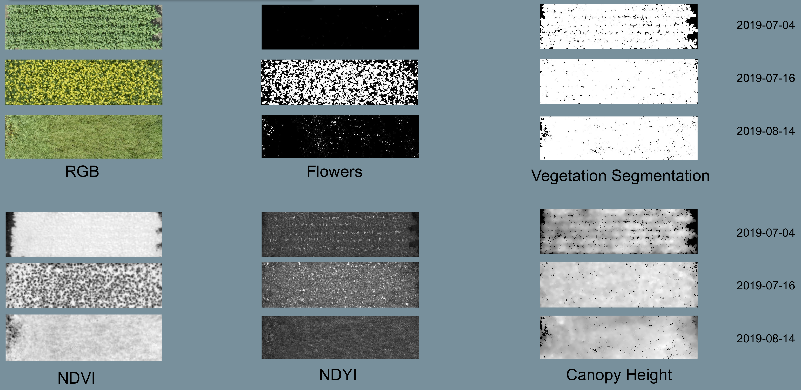

Data Exportation
=====================================

How to Export
------------------------------------------

There are two buttons that can bring you to your results after a segmentation has been processed. The basic choice is to use the Data Export button on the left toolbar. This opens a popup where Trials and Missions can be selected. Bulk Exports are also possible from this popup, and downloading from multiple missions at once is usually quicker from here.

.. image:: /images/exports/bulk_export.png
    :width: 800
    :alt: IMAGE FAILED; ALT DESCRIPTION: Bulk export can be accessed at the bottom portion of the download modal; which is available in the left hand toolbar.
|

If data is only needed from a specific mission that you’ve already found in the dashboard, the export buttons from the mission panel are also an option. From here the same panel where you can export the orthomosaic, DSM, and CSV file will open.

.. image:: /images/exports/mission_export.png
    :width: 800
    :alt: IMAGE FAILED; ALT DESCRIPTION: The alternative location for this modal, instead of the side bar, is in the mission section on the right hand side of the main dashboard after selecting a mission that has had a successful segmentation.
|

CSV File Metrics
-------------------------------------

This is the information for all current PlotVision computed per-plot metrics, as exported in the results CSV. All CSV file metrics require :doc:`Plot Extraction` to generate. For each metric, the associated column names in the results CSV are detailed. See also `Bands Specification`_ and `List of Indices`_ below. All metrics are based upon the individual plot image & plot Digital Surface Model (DSM) extracted from the trial orthomosaic image & DSM. Thus all metrics are calculated from the ortho-rectified overhead perspective, and should only be evaluated in that context. Unstitched raw images are not currently included in analysis.

Included metrics:

- Spectral Indices
- Vegetation-segmented Spectral Indices
- Canopy Height
- Canopy Area
- Canopy Volume
- Canola Flower Area

Spectral Indices
^^^^^^^^^^^^^^^^

A variety of spectral indices are computed for every plot image, depending on the available image bands. First, a single-band plot index array is computed, with the same dimensions as the plot image, where each pixel is a computed index value. Next, the index values are aggregated into scalar summary values over the whole image. Currently, the mean and standard deviation of the plot index array are computed.

CSV column names
   | *mean_{INDEX NAME}*: The mean value of all pixels in the plot index array.
   | *std_{INDEX NAME}*: The standard deviation of all pixels in the plot index array.

*INDEX NAME* is specified separately for each index (see `List of indices`_).

Vegetation-Segmented Spectral Indices
^^^^^^^^^^^^^^^^^^^^^^^^^^^^^^^^^^^^^

These values are calculated in the same way as Spectral Indices, with one extra step. Prior to aggregating the index into summary values, a vegetation mask is computed and applied for the plot image, separating the image into vegetation and non-vegetation pixels. Then the summary values for the index are computed for the vegetation pixels only. To create the vegetation mask, automatic thresholding is applied to the first spectral index available from NDVI, Excess Green, or Blue NDVI.

CSV column names
   | *mean_{INDEX NAME}_segmented*: The mean value of all vegetation pixels in the plot index array. This is an image that has been masked so that only vegetation pixels are included in the mean calculation.
   | *std_{INDEX NAME}_segmented*: The standard deviation of all vegetation pixels in the plot index array.

*INDEX NAME* is specified separately for each index (see `List of indices`_).

Canopy Area
^^^^^^^^^^^

Only available for georeferenced missions, where the width and length in UTM coordinates of each pixel can be computed. Canopy area is calculated by first computing a vegetation segmentation for the plot image, separating the image into vegetation and non-vegetation pixels. Then vegetation area in square meters is derived from GPS information.

.. math::
    \frac{V}{N} \times A

Where:
    | *V* is the number of vegetation pixels in the plot image.
    | *N* is the number of pixels in the plot image.
    | *A* is the area of the plot as calculated from UTM coordinates.

CSV column names
    *crop_area_m2_{INDEX NAME FOR VEGETATION SEGMENTATION}-based*: plot canopy area in square meters, computed from the ortho-rectified overhead perspective.

Canopy Height
^^^^^^^^^^^^^

Only available for georeferenced missions, where the width and length in UTM coordinates of each pixel can be computed. Canopy height is calculated by first computing a vegetation segmentation for the plot image, separating the image into vegetation and non-vegetation pixels. Then elevation values in meters for plant pixels are then compared against the computed ground elevation, and height values are calculated. An aggregate of these height values are exported.

.. math::
    f(H) - f(G)

Where:
    | *f* is the vegetation segmentation function.
    | *H* is the elevations of each pixel in the plot.
    | *G* is the elevations of the ground level in the plot.

CSV column names
   | *mean_crop_height_m_{INDEX NAME FOR VEGETATION SEGMENTATION}-based*: mean plot canopy height in meters.
   | *median_crop_height_m_{INDEX NAME FOR VEGETATION SEGMENTATION}-based*: median plot canopy height in meters.
   | *max_crop_height_m_{INDEX NAME FOR VEGETATION SEGMENTATION}-based*: max plot canopy height in meters.
   | *std_crop_height_m_{INDEX NAME FOR VEGETATION SEGMENTATION}-based*: standard deviation of plot canopy height in meters.

Canopy Volume
^^^^^^^^^^^^^

Only available for georeferenced missions, where the width and length in UTM coordinates of each pixel can be computed. Canopy volume is calculated by first computing a vegetation segmentation for the plot image, separating the image into vegetation and non-vegetation pixels. Then vegetation volume in meters cubed is derived from GPS information.

.. math::
    H \times A

Where:
    | *H* is the canopy height in *m*
    | *A* is the canopy area in *m:sup:`2`*

CSV column names
   | *crop_volume_m3_{INDEX NAME FOR VEGETATION SEGMENTATION}-based*: plot canopy volume in meters cubed.
   | *ground_dilation_pix_{INDEX NAME FOR VEGETATION_SEGMENTATION}-based*: value used for internal debugging. Can be ignored.

Canola Flower Area
^^^^^^^^^^^^^^^^^^

The area in meters squared covered by flowering canola from the ortho-rectified overhead perspective. Only relevant or included in crop that have flowering processes designed (such as canola).

CSV column names
   | *flower_area_m2*: The area in meters squared covered by flowering canola from the ortho-rectified overhead perspective.
   | *flower_fraction_of_plot_area*: the fraction of the total area of the plot (soil included) that is covered by flowers.

Bands Specification
^^^^^^^^^^^^^^^^^^^

Metrics are currently calculated according to named colour bands, not by exact wavelength values. So two different cameras can have a different wavelength for "Red", and PlotVision will naively treat them the same for the purposes of index calculations. Thus the onus is on the user to account wavelength differences between sensors. Nevertheless, a specification of roughly expected wavelengths follows:

.. list-table:: Band Specification
   :widths: 25 25 50
   :header-rows: 1

   * - Abbr.
     - Band
     - Colour Spectrum Range
   * - B
     - Blue
     - 443nm - 507nm
   * - G
     - Green
     - 533nm - 587nm
   * - R
     - Red
     - 654nm - 682nm
   * - RE
     - RedEdge
     - 705nm -729nm
   * - NIR
     - Near Infrared
     - 785nm - 899nm

List of indices
^^^^^^^^^^^^^^^

All current **Spectral Indices** and **Vegetation-Segmented Spectral Indices** for PlotVision. See `Bands Specification`_ for definitions of colour bands within formulas. *INDEX NAME* defines the name used for the index in the results CSV. It is very easy to add to this list. See `here <https://www.indexdatabase.de/db/i.php>`_ for suggestions. If you want an index to be added, please contact anyone on the PlotVision team.

**Anthocyanin reflectance index (ARI)** [#f1]_
   | Formula: :math:`\frac{1}{G} - \frac{1}{RE}`
   | INDEX NAME: ari
   | Emphasizes purple coloured pixels, such as plants with high amounts of anthocyanin. In some crops, the presence of anthocyanin is a marker of stress.

**custom chlorophyll index (non-standard)**
   | Formula: :math:`\frac{1}{RE} - \frac{1}{NIR}`
   | INDEX NAME: chl
   | Can estimate the chlorophyll content of the images leaves. It is sensitive to small variations in the chlorophyll content, and is consistent across multiple crop kinds.

**Excess Green (ExG)** [#f2]_
   | Formula: :math:`2G - B - R`
   | INDEX NAME: excess_green
   | A common spectral index used for a variety of applications. It emphasized green pixels, and has been used as estimates for crop vigour, abiotic stress tolerance, and biomass. Often, it is used as a replacement for NDVI when the imaging sensor lacks an NIR band.

**Normalized Difference RedEdge Index (NDRE)** [#f3]_
   | Formula: :math:`\frac{NIR - RE}{NIR + RE}`
   | INDEX NAME: ndre
   | This metric has similar uses as NDVI and ExG, but is computed using the RedEdge colour band instead of Red. The purpose is to better estimate chlorophyll content, and is mainly used to detect stresses in the plots, rather than vigour.

**Normalized Difference Vegetation Index (NDVI)** [#f4]_
   | Formula: :math:`\frac{NIR - R}{NIR + R}`
   | INDEX NAME: ndvi
   | NDVI is the most popular vegetative index, with a wide range of uses. NDVI has been used to estimate biomass, plant health, vigour, and yield. Foliage is highly reflective in the NIR spectrum, and not reflective in Red, meaning healthy foliage is emphasized.

**Normalized Difference Yellowness Index (NDYI)** [#f5]_
   | Formula: :math:`\frac{G - B}{G + B}`
   | INDEX NAME: ndyi
   | Emphasizes yellow pixels in the image. Useful for the detection of yellow flowers, particularly in canola (*brassica napus L.*).

**Normalized Green Red Difference Index (NGRDI)** [#f8]_
   | Formula: :math:`\frac{G - R}{G + R}`
   | INDEX NAME: ngrdi
   | As a metric, it is thought to be more useful for a measurement of plant growth and canopy closure in low resolution imagery, rather than using NDVI. It's still commonly used as a measure of plant health though, where the NIR band isn't available.

**Sentera NDVI** [#f6]_ [#f7]_
   | formula: Custom NDVI formula for Sentera sensors
   | INDEX NAME: sentera_ndvi

**Sentera NDRE** [#f6]_ [#f7]_
   | formula: Custom NDRE formula for Sentera sensors
   | INDEX NAME: sentera_ndre

Image Exports
--------------

This section details all the various images available to export in PlotVision. The Orthomosaic and DSM exports are the most basic, and do not require :doc:`Plot Extraction`, but all other images do. Any image that requires plot extraction first should be found within a Bulk Export. Further, during plot extraction, the check box asking to generate the data should also have been checked.

Orthomosaic and DSM
^^^^^^^^^^^^^^^^^^^

The orthomosaic and DSM are the two most basic exports PlotVision provides. They require no extra input beyond the raw UAV images themselves (please look at :doc:`Pre-Flight Information` before imaging a research trial). Every mission will have the orthomosaic and DSM available for export from the dashboard as soon as stitching has completed.

The orthomosaic will be in .tif format, and have a number of channels equal to the input image. For example, for a RedEdge orthomosaic, the shape of the image will be ``(WIDTH, HEIGHT, 5)``, because a RedEdge camera captures 5 colour channels. RGB cameras cameras capture 3 channels. The DSM is a greyscale floating point image, where each pixel represents an altitude. The borders of both of these images will have a non-zero value to represent ``null``, or a non-existent pixel value, usually set at the max possible value for the image type. If viewing these images in ArcGIS or QGIS, it is recommended to scale the image values to exclude the extremes of the border.

Cropped Orthomosaic Images
^^^^^^^^^^^^^^^^^^^^^^^^^^

Cropped orthomosaic images are only available to export after a segmentation in which plot images were selected is finished processing. For each plot in the segmentation, the orthomosaic will be cropped to contain only that plot, named according to the plot name, and be saved in the same image format as the orthomosaic. These images are available for download in the Bulk Export section of the export popup, at the bottom. In the case of non-RGB orthomosaics, a "viewable\_" version of the image should also be available. This would contain only the RGB channels of the image, and is designed only to be used by humans inspecting the data for accuracy.

Beyond this, the same orthomosaic with various spectral indices and metrics applied is also available for download. These images will usually be a greyscale version of the orthomosaic with the given metric applied. These images can be downloaded at the bottom of the export popup, under the options in a Bulk Export.

|

Cropped Index Images
^^^^^^^^^^^^^^^^^^^^

Similar to the cropped orthomosaic images, these are only available after a successful segmentation in which plot images were chosen to be generated. These images will be in greyscale, and are simply the orthomosaic with the given spectral indices applied, then cropped to the plot.

Cropped _Segmented Index Images
^^^^^^^^^^^^^^^^^^^^^^^^^^^^^^^

The "\_segmented" version are the same as cropped images, however they are masked such that only vegetation is included. Non-plant pixels have been blacked out using our proprietary vegetation segmentation algorithm, and plant pixels have remained untouched. This allows for computations that require only plant pixels. Similarly, these are the images used to generate the "\_segmented" version of the CSV metrics.

To verify the accuracy of our vegetation segmentation algorithm, or for your own personal use, also provided in the export is the segmentation mask generated.

Other Non-Image Exports
------------------------

There are a few other exports available in PlotVision that have not been covered so far. These are all available as options within the Bulk Export.

Photogrammetry Report (PDF)
    A PDF report on how the orthomosaic progressed. Details about georeferencing, camera tilt, and stitching parameters are included in here.

Trial Metadata
    Data uploaded by the user as information about the trial. This includes:

    - GCPs
    - Trial Map
    - Plots Info

Plot Metadata (JSON)
    A JSON format file of the plot segmentation.

    - "plots": plot bounding boxes in the ortho
    - "trial corners": corners selected by user when segmenting
    - "trial_corners_osvr": trial corners again, but this time in the smaller, viewable, and rectified (oriented) orthomosaic.

TFW Files
    Georeferencing `world files <https://en.wikipedia.org/wiki/World_file>`_ generated by the stitching program, or uploaded by the user in the case of a direct orthomosaic upload.

UUID and GUID files
    A few files in a bulk export could contain only the 16 digit IDs used internally. These are mainly for debugging purposes and can be ignored, unless asked for by Support.

Shapefiles of plots
    Currently not supported, but will be in a near future update. Please contact someone from the PlotVision team if you are looking to export your plots as Shapefiles. They will have similar specification as the :doc:`required input for Shapefiles <Plot Extraction>`.

Correlations
------------

Creating correlations and heatmaps is currently a work in progress for PlotVision development. It is not automatically included in any export. However, you can contact anyone on the PlotVision team and we'll see what we can do for you.

.. rubric:: Footnotes

.. [#f1] Anatoly A Gitelson, Mark N Merzlyak, and Olga B Chivkunova. “Optical properties and nondestructive estimation of anthocyanin content in plant leaves¶”. In: Photochemistry and photobiology 74.1 (2001), pp. 38–45.
.. [#f2] Woebbecke, David M., George E. Meyer, Kenneth Von Bargen, and David A. Mortensen. "Color indices for weed identification under various soil, residue, and lighting conditions." Transactions of the ASAE 38, no. 1 (1995): 259-269. https://elibrary.asabe.org/abstract.asp?aid=27838
.. [#f3] Daniel A Sims and John A Gamon. “Relationships between leaf pigment content and spectral reflectance across a wide range of species, leaf structures and developmental stages”. In: Remote Sensing of Environment 81.2 (2002), pp. 337–354. issn: 0034-4257. doi: https://doi.org/10.1016/S0034-4257(02)00010-X.
.. [#f4] John W. Rouse Jr. et al. "MONITORING THE VERNAL ADVANCEMENT AND RETROGRADATION (GREEN WAVE EFFECT) OF NATURAL VEGETATION". English. 2 RSC 1978-1. CollegeStation, Texas, 77840: Remote Sensing Center, Texas A&M University, Apr. 1973.
.. [#f5] ti Zhang et al. “Phenotyping Flowering in Canola (Brassica napus L.) and Estimating Seed Yield Using an Unmanned Aerial Vehicle-Based Imagery”. In: Frontiers in Plant Science 12 (June 2021). doi: https://doi.org/10.3389/fpls.2021.686332.
.. [#f6] Sentera Support. "FAQ: How Does FieldAgent Calculate NDVI, Red Edge, or Other Index Data?". url: https://support.sentera.com/portal/en/kb/articles/faq-how-does-fieldagent-calculate-ndvi-red-edge-or-other-index-data
.. [#f7] Sentera Support. "Sensor Specifics". url: https://support.sentera.com/portal/en/kb/sentera/sensor-specifics
.. [#f8] E.T. Kanemasu. “Seasonal canopy reflectance patterns of wheat, sorghum, and soybean”. In: Remote Sensing of Environment 3.1 (1974), pp. 43–47. issn: 0034-4257. doi: https://doi.org/10.1016/0034-4257(74)90037-6.
