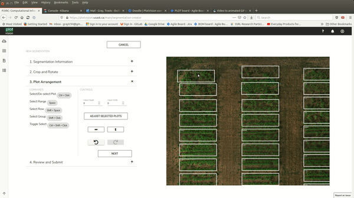

Plot Extraction
=================

Overview/Basics
---------------

The purpose of a segmentation is to obtain per-plot metrics such as NDVI, heights, or cropped images. A basic segmentation in PlotVision has three steps:

1. Create the segmentation
2. Fit the Edges of the Trial
3. Adjust Plot boxes

Step 1: Creating a Segmentation
^^^^^^^^^^^^^^^^^^^^^^^^^^^^^^^

To create a segmentation, a Trial Map must be uploaded first. This is most commonly done during the Upload Step 2 (Uploading Metadata), but can also be uploaded afterwards, in the Trial Manager.

First, select a mission from the Trial Dashboard, and select the first button to enter the Segmentation Dashboard for that mission.

.. image:: /images/segmentation/entry.png
    :width: 800
    :alt: IMAGE FAILED; ALT DESCRIPTION: Select a mission thumbnail, then the segmentation button on the right.
|

From here, begin a new Segmentation, and name it. If this is the first segmentation for the mission, and it completes successfully, it will automatically become the Default Segmentation for the mission.

.. image:: /images/segmentation/start.png
    :width: 800
    :alt: IMAGE FAILED; ALT DESCRIPTION: Press New Segmentation to begin. On the left should appear a list of previously done segmentations if any.
|

.. image:: /images/segmentation/name.png
    :width: 800
    :alt: IMAGE FAILED; ALT DESCRIPTION: Every segmentation for a mission requires a different name.
|

Step 2: Fit Edges of Trial
^^^^^^^^^^^^^^^^^^^^^^^^^^

In this step, the user will need to select the four corners of the trial using Ctrl+Click. It’s important that the corners selected in this step are performed in order. Please follow the instructions on the left as to which corner order to click in. After this step, the orthomosaic will be cropped and rotated so that (a) only the plots are visible and (b) the first plot is in the top left corner. If this is not true, please double check the uploaded Trial Map, and the order in which you clicked corners.

.. image:: /images/segmentation/select_corners.png
    :width: 800
    :alt: IMAGE FAILED; ALT DESCRIPTION: Using Ctrl+Click, select the 4 corners of the trial, getting as close to accurate as possible.
|

.. image:: /images/segmentation/crop_and_rotate.png
    :width: 800
    :alt: IMAGE FAILED; ALT DESCRIPTION: Hit crop and rotate to move on the to next step.
|

Step 3: Adjust Plot Boxes
^^^^^^^^^^^^^^^^^^^^^^^^^

At this point, plot boxes should be automatically placed onto the orthomosaic according to the dimensions specified by the Trial Map. However, small adjustments are often needed on the plots to get a perfect segmentation. One can simply click and drag plot boxes around as required. Boxes can also have their size changed. Multiple plots can be selected at one time using a Ctrl+Click.

.. image:: /images/segmentation/moving.gif
    :width: 800
    :alt: IMAGE FAILED; ALT DESCRIPTION: Clicking and dragging plots should move them.
|

.. image:: /images/segmentation/adjust_size.gif
    :width: 800
    :alt: IMAGE FAILED; ALT DESCRIPTION: You can adjust the size of the plots on the left, with positive or negative numbers to increase or decrease all plots selected.
|

Advanced Tooltips
-----------------

- Clicking a plot will move the yellow box to that plot
- Shift+Click on a plot to select all plots between the yellow plot and the clicked plot
- Space will select the entire range the yellow plot is in
- Moving the first and last plot of a range to fit, then selecting all the plots and Vertically Auto-Adjusting

Multi-Select and using Shift Click are the most basic of the Advanced Tools, and makes for quick work of some nasty segmentations

.. image:: /images/segmentation/multiselect.gif
    :width: 800
    :alt: IMAGE FAILED; ALT DESCRIPTION: Using the Ctrl button, you can select more than one plot.
|

Selecting the entire range that the yellow plot is located in is also powerful, but it’s main use is when combined with other tools

.. image:: /images/segmentation/move_range.gif
    :width: 800
    :alt: IMAGE FAILED; ALT DESCRIPTION: Using the spacebar, you can select an entire range of plots.
|

The most common use case of the Advanced Tools is when the plots extend beyond the range at the bottom of the orthomosaic. Instead of manually moving each plot one by one up a little bit to the correct location, try a combination of

1. Correctly positioning the top plot and the bottom plot of a range
2. Using the range selection tool to highlight every plot in the range
3. Using the Vertical Distribution tool to position every plot correctly

|

Propagating to Future Missions
------------------------------

Another tool created to make plot extraction easier, the ability to propagate previously complete segmentations. Plot Propagation is the current method of transferring a finished segmentation from an earlier mission onto new missions. This is done by saving the adjustments made to the plots during a segmentation. After selecting the four corners of the trial, the small adjustments will be used in the initial drawing of the plots, instead of the default square grid.

The segmentation used for propagation is a random default segmentation from another mission in the trial. There is currently no method for choosing which segmentation to propagate from. Further, there are future updates planned that will provide a tool that will replace this feature.

.. image:: /images/segmentation/propagation.png
    :width: 800
    :alt: IMAGE FAILED; ALT DESCRIPTION: The button to propagate a previous segmentation is in the same view as naming a segmentation, in a checkbox.
|

Vector Files
-------------

Vector files are a method to obtain automatic plot segmentation based on inputted plot bounding boxes in a supported vector file format. Currently, Shapefiles and GeoJSON files are currently supported. If these files have already been created, and the orthomosaic for a mission in PlotVision is georeferenced, you can upload these files to generate automatic segmentations. By finding your trial in the trial manager, you can upload your vector file at the bottom of the screen, after pressing the dash under the Shapefile column.

.. image:: /images/segmentation/upload_vector_files.png
    :width: 800
    :alt: IMAGE FAILED; ALT DESCRIPTION: Trial metadata such as vector files can be uploaded from the trial manager screen.
|

Shapefiles
^^^^^^^^^^^

The primary vector file we support are Shapefiles. `Shapefiles <https://en.wikipedia.org/wiki/Shapefile>`_ are commonly used in programs such as ArcGIS and QGIS. In our shapefiles, we require that each plot contain the specific fields:

- ``id``: a String with the plot name
- ``trial_name``: a String with the name of the trial
- ``trial_year``: an Integer with the year of the trial

.. image:: /images/segmentation/shapefiles.png
    :width: 800
    :alt: IMAGE FAILED; ALT DESCRIPTION: Shapefiles of plots withing the QGIS software.
|

GeoJSON
^^^^^^^^

The other type of supported Vector File input instead of a trial map, is a GeoJSON file. In a GeoJson, each plot is simply a Feature with properties and geometry.

Properties
    Four properties are required for a plot
        - ``Trial Name``: The name of the Trial. Required within every plot as well as at the beginning of the trial
        - ``Plot ID``: The name of the plot
        - ``Range``: The range number of the plot
        - ``Row``: The row number of the plot

Geometry
    The geometry of a plot is a list of coordinates in Latitudes and Longitudes, with the first and last point being identical. Currently, only perfect rectangles are supported.

.. code-block::
    :caption: An example of a single plot GeoJSON

    {
        "type": "FeatureCollection",
        "name": "TRIAL NAME",
        "crs": {
            "type": "name",
            "properties": {
                "name": "urn:ogc:def:crs:OGC:1.3:CRS84"
            }
        },
        "features": [
            {
                "type": "Feature",
                "properties": {
                    "Trial Name": "TRIAL NAME",
                    "Plot ID": "Border",
                    "Range": "1",
                    "Row": "1",
                },
                "geometry": {
                    "type": "MultiPolygon",
                    "coordinates": [
                        [
                            [
                                [
                                    -97.25913321674533,
                                    49.65617169721878
                                ],
                                [
                                    -97.2591332138398,
                                    49.656182488633114
                                ],
                                [
                                    -97.25909719820562,
                                    49.65618248454055
                                ],
                                [
                                    -97.25909720111912,
                                    49.656171693126296
                                ],
                                [
                                    -97.25913321674533,
                                    49.65617169721878
                                ]
                            ]
                        ]
                    ]
                }
            },
        .........
        }
