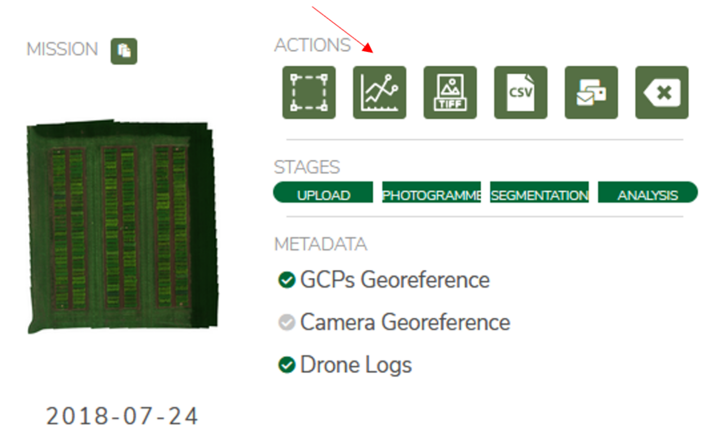
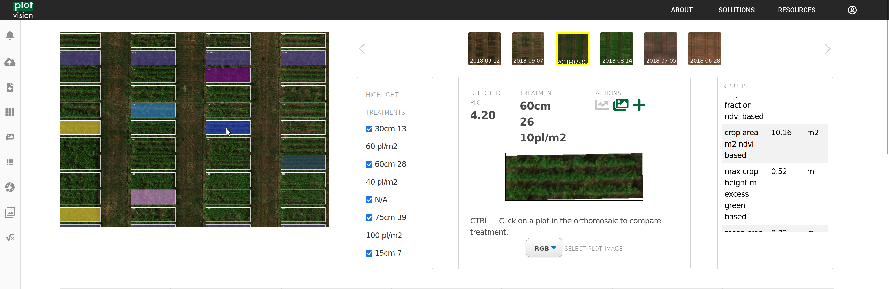
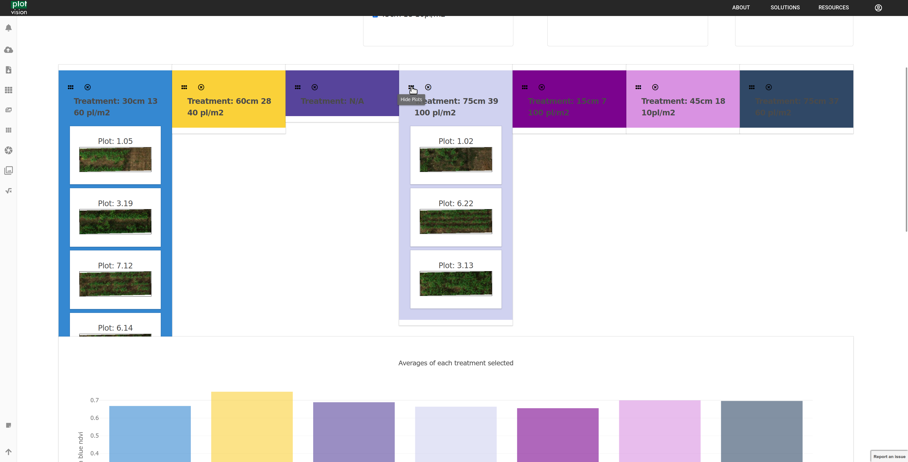
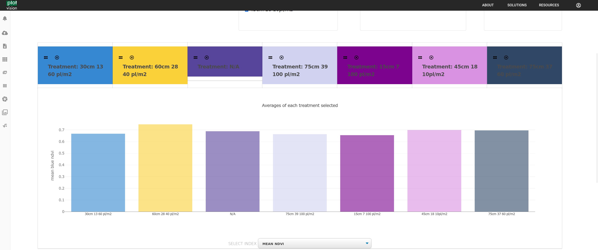
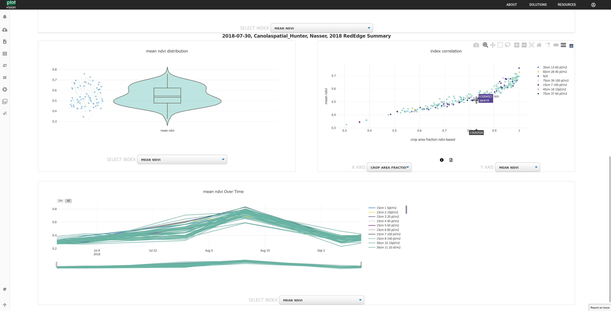

PlotWorkspace
================

The PlotWorkspace is an advanced data inspection tool designed to provide an interactive view of the results, plots, and orthomosaic. After a successful segmentation, the button on the dashboard, or for a specific segmentation, should become available. Within, users can inspect the orthomosaic and plot bounding boxes of the segmentation. Detailed per-plot views and per-replicate views allow for an in depth look at the performance of each plot or variety, and useful charts allow for comparisons across the entire trial.

|

The orthomosaic, with the overlayed segmentation, list of varieties, and details about any plot you select, is the first portion of the PlotWorkspace. Any varieties chosen will display with colour on the orthmosaic, and will be highlighted in future graphs and charts. Any selected plot will appear on the right. Namely, you can select between the different types of imagery we have on the plot, such as viewing the NDVI or the NDVI_Segmented image.

|

If selecting by treatments in the orthomosaic, you can view all the plots contained in that treatment here.

|

And you can make comparisons between treatments for any metric offered by PlotVision.

|

Correlations can be determined quickly by comparing metrics, and data over time can be viewed if multiple segmentations are performed on a trial.

|

