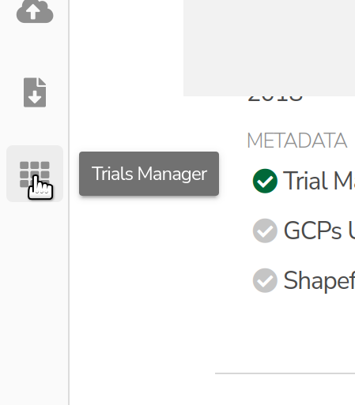
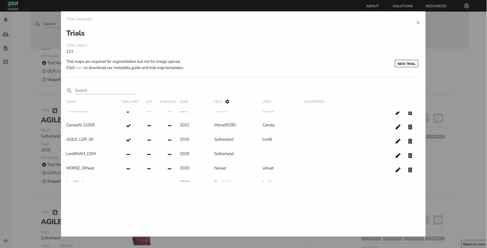
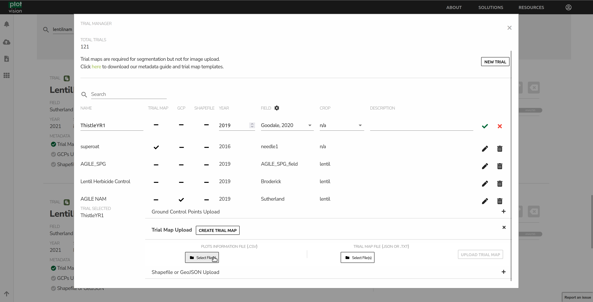
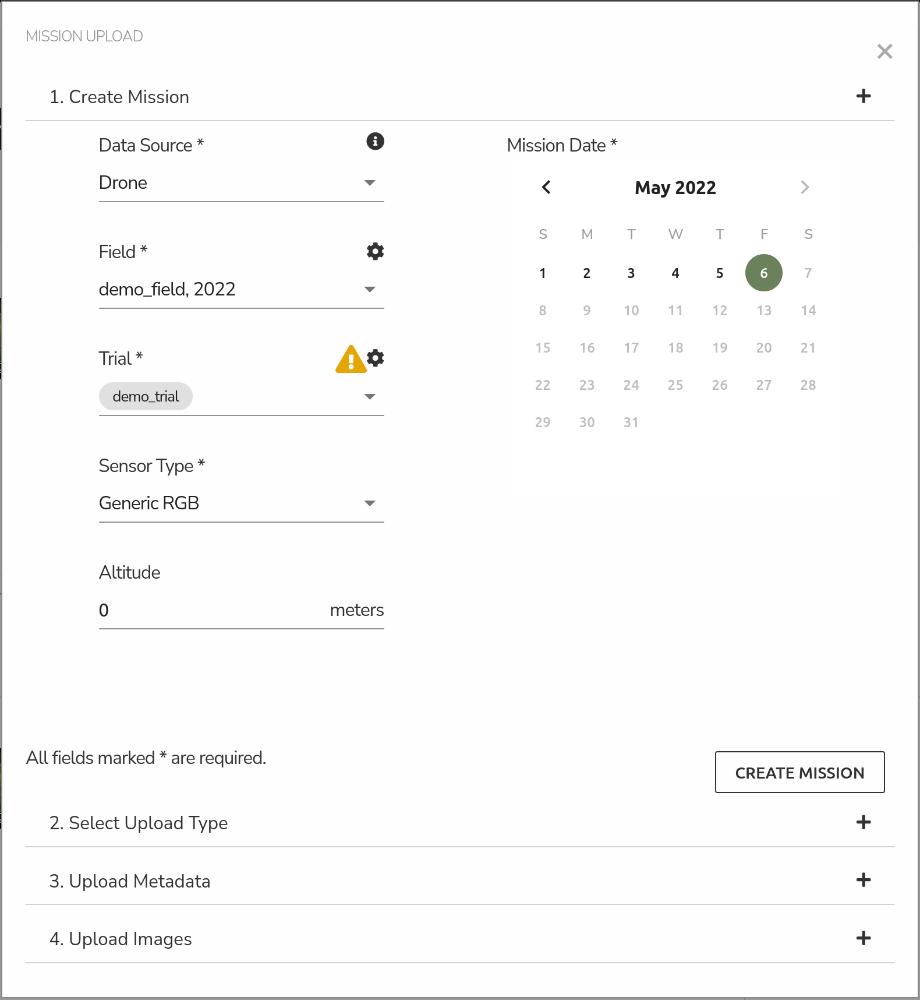
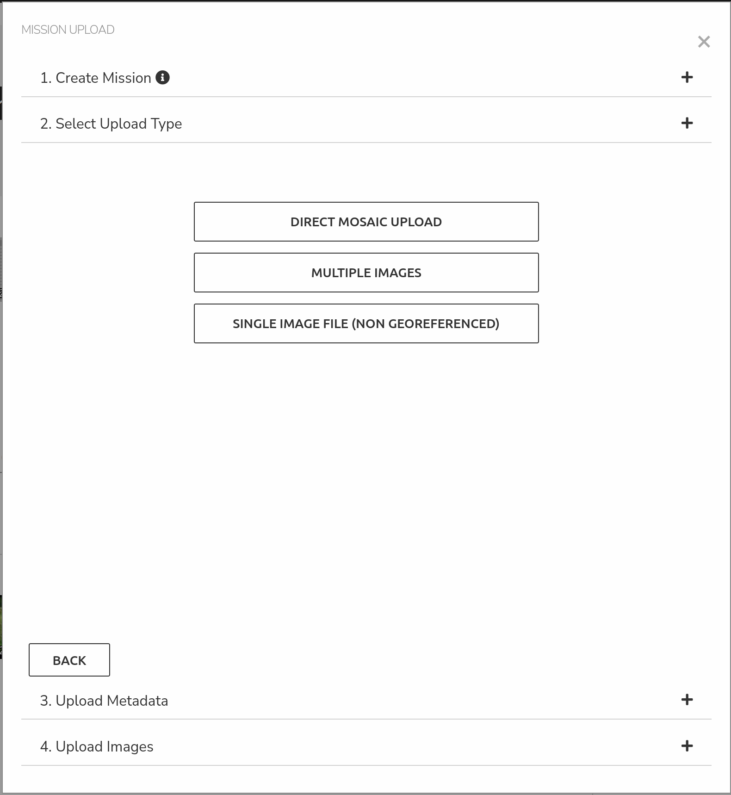
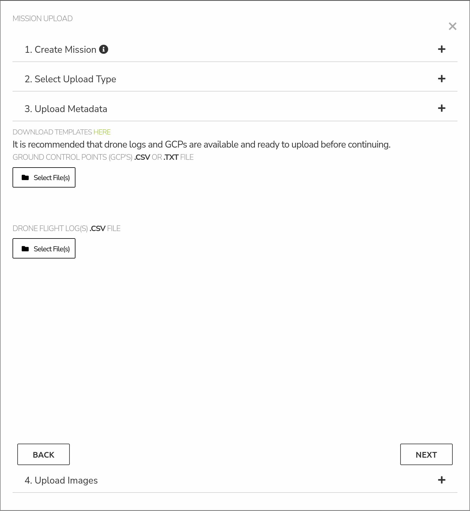
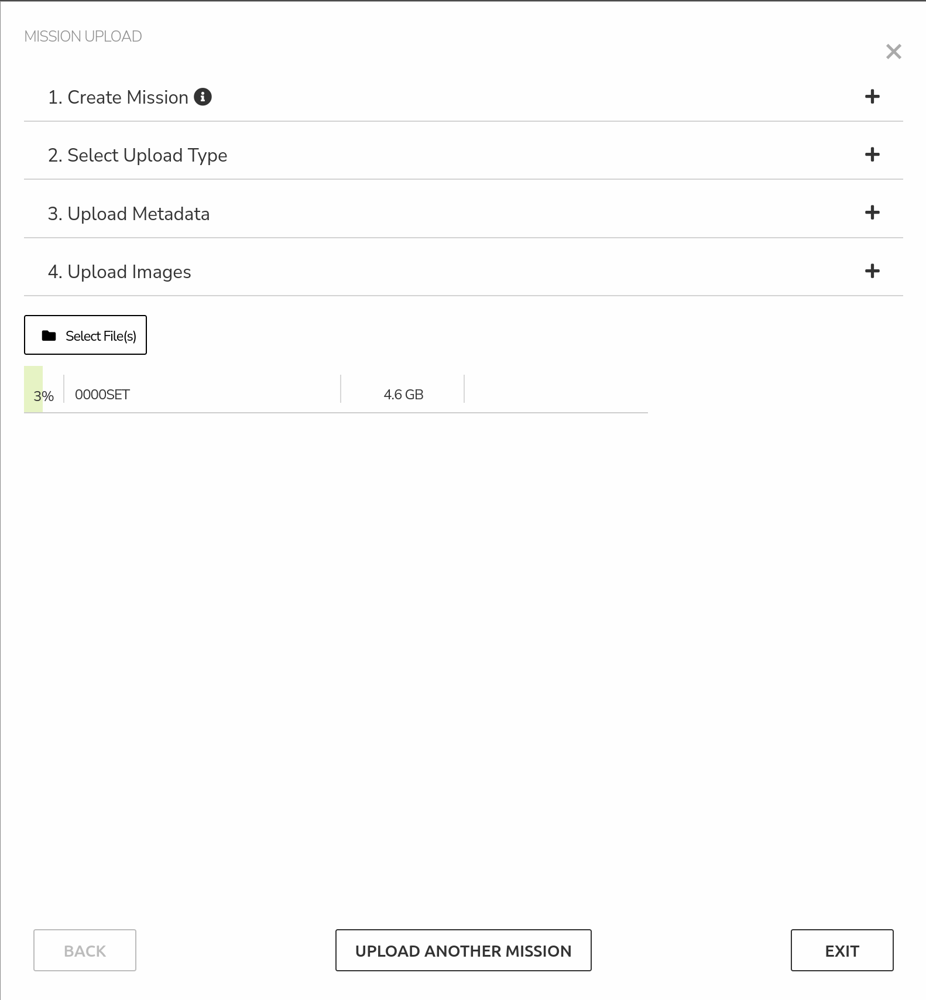

Uploading a Mission Flight
==============================

To upload a flight mission in PlotVision, first the Field and Trial for that mission must be created. A field is a location that can contain a number of trials. Usually, a flight will capture the entire field for one orthomosaic, but this is not always the case. Further, every field on PlotVision is associated with a year. If planting in the same field on a later year, please create a new field with the same name but different year.

A research trial is a group of plots containing a plant breeding experiment. There can be multiple trials in one field, as well as multiple trials in one captured mission. Every trial must have a field, and every mission must have captured at least one trial.

Trial/Field Creation
---------------------

There are multiple ways to create a field or trial in PlotVision, but all will bring you to similar creation pages. From the Dashboard, opening the Trial Manager from the left sidebar is the most straight forward way.

|

The Trial Manager page is an advanced tool that allows you to create, edit, delete, and upload metadata for your trials.

1. Create new trials.
    Selecting the option to create a trial without metadata will simply ask you to fill in the name, year, field, and crop of the trial. For uploading with metadata, please check out `Trial Map and Plot Info Files`.
2. Edit/Delete trials.
    Selecting these buttons will allow you to edit the properties of a trial, or delete it from PlotVision.
3. Uploading Metadata.
    Selection the option of Trial Map, GCPs, or Shapefile

|

Trial Map and Plot Info Files
------------------------------

The Trial Map JSON and Plot Info CSV files are the last two puzzle pieces to be able to create a segmentation. They are files that explain the layout of a trial, and where specific plots and varieties exist within that trial.

A new tool is currently in the works to create these two files on the PlotVision site without needing to edit files. In the interim, our metadata guide can be found `here <https://plotvision.usask.ca/files/plotvision_metadata_guide.pdf>`_

To upload your newly created Trial Map and Plot Layout files, head over to the trial manager, and select the dashed line under the Trial Map field for your trial. From the bottom, select your two files, and upload them to PlotVision.

|

Mission Upload
---------------

Step 1: Create a Mission
^^^^^^^^^^^^^^^^^^^^^^^^^

Before uploading your imagery, you will need to create a mission. Select the date which you collected the images and fill the required metadata from the dropdown options on the left. If this is the first mission of the trial, you may need to create a new Field or Trial. This can be done using the gear icon. Fields need to be created first, and a new Field or Trial must be created every year.
When creating a trial, if a segmentation is going to be performed in the future, then a Trial Map will need to be uploaded. This can be done on Trial Creation, or at a later date. Please reference our Trial Map documentation for information on how to create one.

|
Step 2: Upload Metadata and Imagery
^^^^^^^^^^^^^^^^^^^^^^^^^^^^^^^^^^^^

Select the appropriate option for your upload. If you already have obtained an Orthomosaic and a DSM (and, optionally, TFW files for each) from another software, you can upload these. Or, you can have PlotVision take care of it, in which case you just need the images from the UAV.

ou only have either the orthomosaic or a single image of the trial.

After selecting the appropriate option for your upload, you will be prompted to upload optional metadata, such as GCP or Drone flight logs (if available) for your mission. GCPs are only uploaded once per trial, so if you uploaded them previously, uploading them again will replace the previous file. After this step, click next.

In this step, you can select the CSV file containing information about the Ground Control Points for the trial.
Drone Logs for the flight can also be selected here.
Both are optional, and you can hit Next after uploading both, one, or none.

In this step, you can now select the folder that contains your images (or orthomosaic).
After selecting the folder, upload will automatically start. Click next for the final step.

|
Step 3: Confirm and Exit
^^^^^^^^^^^^^^^^^^^^^^^^^

|

After the images have been selected for upload, it’s safe to leave this popup. This means you can continue with more uploads, or continue with other work on PlotVision. However, **do not close the PlotVision window or refresh the page until the upload is fully complete**. Doing any of those actions will cancel the upload.
**The progress of your uploads can be found in the bottom left corner. Uploads can be paused, resumed, and cancelled from here.**

Multiple Trials in One Mission/Flight
--------------------------------------

PlotVision also supports having more than one trial contained in the same mission flight. This is extremely easy to setup. When creating the first trial, proceed everything as normal. When creating subsequent trials, make sure to select the same year and field as the first trial. Now, when uploading a mission, when selecting a trial, a checklist of the various trials located in that field will appear. Simply select all the trials you flew this mission, and PlotVision will handle the rest.

You are required to submit a separate trial map for each trial, even if they are in the same field.
